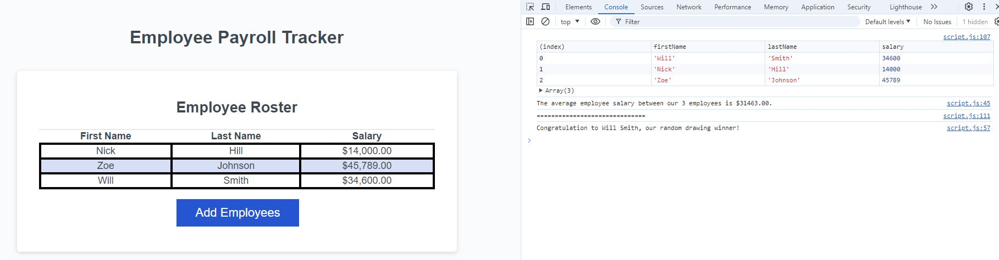

# Challenge 3 (JavaScript): Employee Payroll Tracker

## Description
This application enables a payroll manager to view and manage employee payroll data. The app features dynamically updated HTML and CSS powered by JavaScript.

## User Story
AS a payroll manager,
I WANT an employee payroll tracker,
SO THAT I can see my employees' payroll data and properly budget for the company.

## Acceptance Criteria
GIVEN an employee payroll tracker, 
WHEN I click the "Add employee" button,  
THEN I am presented with a series of prompts asking for first name, last name, and salary. 
WHEN I finish adding an employee, 
THEN I am prompted to continue or cancel. 
WHEN I choose to continue, 
THEN I am prompted to add a new employee. 
WHEN I choose to cancel, 
THEN my employee data is displayed on the page sorted alphabetically by last name, and the console shows computed and aggregated data.

## How to Use
1. Click the "Add Employees" button. 
2. Enter the first name, last name, and salary of each employee. 
3. Choose to continue adding employees or stop to display the data. 

## Technologies Used
- HTML 
- CSS 
- JavaScript 

## Screenshot

## License
This project is licensed under the MIT License.

## Link to the web page
